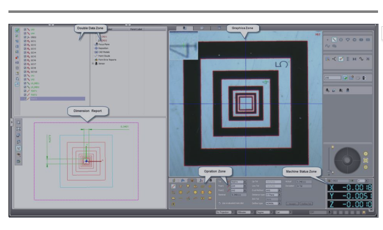
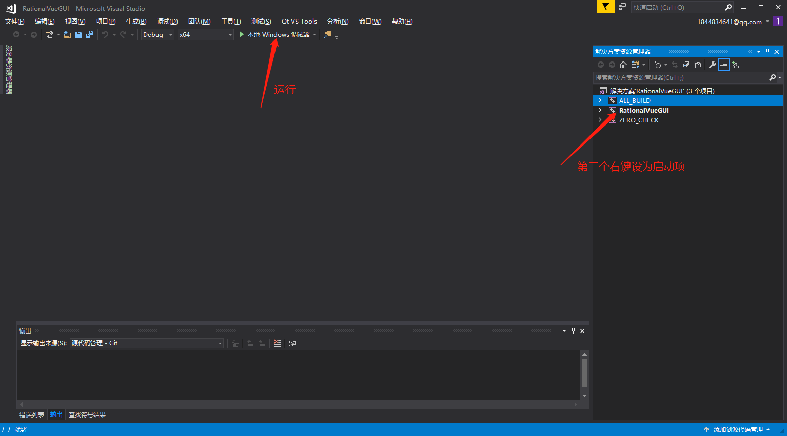

# README

​    **当前工程只进行到界面阶段。暂时仅仅记录界面的工作。**

## 1.文件结构

暂时只有GUI界面文件的文件结构介绍

界面文件夹结构主要是参照下面这个图：



GUI各个模块对应的文件夹如下：

- DataZone：

  ​		DataZoneLeft

  ​		DataZoneRight

- DimensionReportZone:

  ​		DimensionReportZone

- GraphiceZone:

  ​		GraphiceZone

- OperationZone:

  ​		OperationZoneLeft

  ​		OperationZoneRight

- PaintZone:

  ​		PaintZone

- MachineStatusZone:

  ​		MachineStatusZone

- StatusBarZone:

  ​		StatusBarZone

- MenuBarZone:

  ​		MenuBarZone

- MainWindow:主窗口

  ​		MainWindow

## 2.使用方法

每个模块的目录下面都有一个类，模块负责人只需要修改这个类就行。可以在Qt Creator中创建工程，然后将平时的mainwindow改成相应的类名就行。在Qt Creator中设计完界面后，将工程下的所有.cpp,.h,.ui,.prc以及用到的资源（图片等）都拷贝到相应文件夹（main.cpp不用拷，并且只要前面的文件，资源是你要用的资源，比如项目中的图片）。

## 3.构建步骤

- 软件依赖：

  1. cmake
  2. qt

- 构建

  直接运行build.sh文件，或者自己照下面操作。

  ```bash
  #进入根目录，如果在根目录打开git bash就不需要这一步
  cd RationalVue
  
  #创建目录，并进入目录，在里面构建项目，build可以更改
  mkdir build 
  cd build
  cmake -G "Visual Studio 15 2017 Win64" ..
  ```
  
  ## 4.运行
  
  上一步完成后在build文件夹下会生成.sln文件，直接用VS打开即可。
  
  然后照下图操作即可


